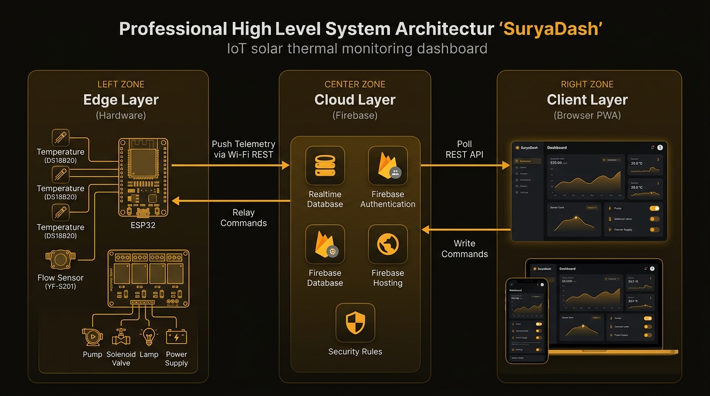

<div align="center">

  

  # ☀ SuryaDash

  ### _Real-Time IoT Telemetry Dashboard for Solar Thermal Collectors_

  [](https://mradul-consultancy.github.io/SuryaDash-/)
  [](https://github.com/Mradul-Consultancy/SuryaDash-)

  <br>

  
  
  
  
  
  

  <br>

  **SuryaDash** _(Surya = Sun in Sanskrit)_ is a production-ready, enterprise-grade web dashboard<br>
  for monitoring, analyzing, and controlling solar thermal collector systems in real-time.

</div>

---

## 📋 Table of Contents

- [Overview](#-overview)
- [Live Demo](#-live-demo)
- [Key Features](#-key-features)
- [System Architecture](#-system-architecture)
- [Tech Stack](#-tech-stack)
- [Getting Started](#-getting-started)
- [Firebase Setup](#-firebase-setup-production)
- [Hardware & Firmware](#-hardware--firmware)
- [Data Model](#-data-model)
- [Project Structure](#-project-structure)
- [Configuration](#%EF%B8%8F-configuration)
- [Testing & CI/CD](#-testing--cicd)
- [Deployment](#-deployment)
- [Security](#-security)
- [Roadmap](#-roadmap--whats-next)
- [Contributing](#-contributing)
- [License](#-license)

---

## 🌟 Overview

**SuryaDash** is a full-stack IoT solution that connects solar thermal collector hardware (ESP32 + sensors) to a real-time web dashboard through Firebase. It calculates thermal power, collector efficiency, energy savings, and raises intelligent alarms — all from the browser.

### The Problem
Solar thermal systems require constant monitoring to detect stagnation, freezing, pump failures, and inefficiency. Traditional SCADA systems are expensive and require proprietary hardware.

### The Solution
SuryaDash provides an **affordable, open-source, browser-based** alternative that works on any device — desktop, tablet, or mobile — with real-time data, smart alarms, and remote control capabilities.

> **No hardware? No problem.** SuryaDash includes a built-in **Demo Mode** with realistic simulated data so you can explore every feature instantly.

---

## 🌐 Live Demo

🔗 **[https://mradul-consultancy.github.io/SuryaDash-/](https://mradul-consultancy.github.io/SuryaDash-/)**

Click "**Skip login — just show me the demo**" to explore the full dashboard with simulated data.

---

## ✨ Key Features

### 📊 Real-Time Telemetry
| Feature | Description |
|---------|-------------|
| **6 Sensor Channels** | T1 (Storage), T2 (Inlet), T3 (Absorber), T4 (Outlet), F1 (Inlet Flow), F2 (Outlet Flow) |
| **Live Calculations** | Thermal Power: `Q = ṁ · cₚ · ΔT`, Collector Efficiency: `η = Q / (G · A)` |
| **Delta Tracking** | Real-time ▲/▼ change indicators with session min/max for every sensor |
| **Unit Toggle** | Switch between °C and °F instantly |

### 🔔 Intelligent Alarm System
| Alarm | Trigger |
|-------|---------|
| 🔥 High Temperature | Absorber (T3), Outlet (T4), or Storage (T1) exceed thresholds |
| ❄️ Freeze Risk | Inlet or Storage temp drops below configurable limit |
| 🚱 Dry-Run | Pump running with zero flow detected |
| ⚖️ Flow Imbalance | Inlet vs. outlet flow mismatch (leak/blockage) |
| 📉 Low Efficiency | Predictive warning when efficiency trends downward |
| ☀️ Stagnation | Absorber temperature exceeds stagnation threshold |
| 📡 Device Offline | Stale data detection when ESP32 stops sending data |

### 🎮 Remote Control
- **4 Actuators**: Power Supply, Solenoid Valve, Pump, Artificial Lamp
- **One-Click Toggle**: Click any control card to switch ON/OFF via Firebase
- **Pressure Monitoring**: Real-time pump pressure bar (green/yellow/red zones)
- **Differential Controller**: Advisory pump logic based on ΔT = T3 − T1

### 📈 Analytics & Reporting
- **Power & Efficiency Trends** — Historical line charts
- **T2 vs T4 Scatter Plot** — Heat transfer analysis
- **7-Day Energy Bar Chart** — Daily energy harvested
- **IEC 12975 η-Curve** — Standardized efficiency curve (with irradiance)
- **Savings Dashboard** — Money saved, CO₂ avoided, tree & petrol equivalents
- **PDF Report** — Print-ready professional report
- **CSV Export** — Download raw sensor data

### 🔐 Multi-Tenant Security
- **Email/Password Auth** via Firebase Authentication
- **Multi-Site Management** — One account, multiple solar collector sites
- **Role-Based Access** — Owner, Member, and Device roles
- **Server-Side Validation** — Firebase Security Rules enforce data shapes and ranges

### 🌐 Web Excellence
- **Progressive Web App (PWA)** — Installable, works offline
- **Dark/Light Theme** — Automatic or manual toggle
- **Responsive Design** — Desktop, Tablet, Mobile with bottom navigation
- **Cookie Consent** — GDPR-compliant consent-gated analytics
- **SEO Optimized** — Open Graph, Twitter Cards, Sitemap, robots.txt

---

## 🏗 System Architecture

<div align="center">
  
</div>

<br>

The system is divided into **three isolated layers** that communicate exclusively through Firebase:

```
┌─────────────────────┐    ┌─────────────────────┐    ┌─────────────────────┐
│   🔧 EDGE LAYER     │    │   ☁️ CLOUD LAYER     │    │   🖥️ CLIENT LAYER   │
│   (ESP32 Hardware)   │    │   (Firebase)         │    │   (Browser PWA)     │
│                      │    │                      │    │                     │
│  4× DS18B20 Probes   │───▶│  Realtime Database   │◀──▶│  Vanilla JS SPA     │
│  2× YF-S201 Flow     │    │  Authentication      │    │  Chart.js Graphs    │
│  4× Relay Channels   │◀───│  Security Rules      │    │  Alarm Engine       │
│                      │    │  Hosting (CDN)       │    │  Solar Physics      │
└─────────────────────┘    └─────────────────────┘    └─────────────────────┘
     Push telemetry            Single source of           Poll & display
     Read commands              truth + auth              Send commands
```

### Design Principles

| Principle | Implementation |
|-----------|---------------|
| **Zero Dependencies** | No React, no Webpack, no npm. Pure vanilla JS loads in < 1 second |
| **Security at the Edge** | Firebase Rules are the _only_ enforcement point — not the client |
| **Graceful Degradation** | Each module fails independently. Charts fail? Dashboard still works |
| **Honest Status** | "LIVE" only for real data. Simulated data is always labeled "DEMO" |
| **Offline First** | PWA service worker caches the app shell for offline access |

---

## 🛠 Tech Stack

| Layer | Technology | Purpose |
|-------|-----------|---------|
| **Frontend** | HTML5 + Vanilla JavaScript (ES6+) | Zero-dependency SPA |
| **Styling** | Custom CSS with CSS Variables | Dark/Light theming |
| **Charts** | Chart.js 4.4.1 (CDN) | Real-time data visualization |
| **Fonts** | IBM Plex Mono + Barlow (Google Fonts) | Monospace data + UI typography |
| **Backend** | Firebase Realtime Database | Real-time data sync |
| **Auth** | Firebase Authentication (REST) | Email/password login |
| **Hosting** | GitHub Pages / Firebase Hosting | Static file serving |
| **Firmware** | Arduino C++ (ESP32) | Sensor reading + relay control |
| **Sensors** | DS18B20 (temp) + YF-S201 (flow) | Field data acquisition |

---

## 🚀 Getting Started

### Prerequisites
- A modern web browser (Chrome, Firefox, Edge, Safari)
- Python 3.x (for local server) _or_ any static file server

### Quick Start (Demo Mode — 30 seconds)

```bash
# Clone the repository
git clone https://github.com/Mradul-Consultancy/SuryaDash-.git
cd SuryaDash-

# Start a local server
python3 -m http.server 8080

# Open in browser
# http://localhost:8080
# Click "Skip login — just show me the demo"
```

---

## ☁️ Firebase Setup (Production)

To connect real hardware and user accounts:

1. **Create a Firebase Project** at [console.firebase.google.com](https://console.firebase.google.com)
2. **Add a Realtime Database** (Start in test mode initially)
3. **Enable Email/Password Auth** → Authentication → Sign-in method
4. **Publish Security Rules** → Paste contents of `firebase-config/database.rules.json`
5. **Copy your Web API Key** → Project Settings → General
6. **Configure the App** → Open dashboard → Settings tab → Paste Firebase URL and API Key

📖 Detailed guide: [`firebase-config/README.md`](firebase-config/README.md)

---

## 🔌 Hardware & Firmware

### Bill of Materials

| Qty | Component | Model | Role |
|-----|-----------|-------|------|
| 1 | Microcontroller | ESP32 DevKit V1 | Wi-Fi + GPIO controller |
| 4 | Temperature Probe | DS18B20 (waterproof) | T1, T2, T3, T4 |
| 2 | Flow Sensor | YF-S201 | F1 (inlet), F2 (outlet) |
| 1 | Relay Module | 4-Channel (5V) | Power, Solenoid, Pump, Lamp |
| 1 | Power Supply | 5V 2A | ESP32 + relay board |

### Flashing the Firmware

```bash
# Required Arduino Libraries:
# - OneWire
# - DallasTemperature  
# - ArduinoJson 6.x

# Edit these 6 lines in firmware/solar_esp32_firmware.ino:
# WIFI_SSID, WIFI_PASS, FIREBASE_HOST, AUTH_TOKEN, SITE_ID
```

📖 Wiring diagram and calibration: [`firmware/README.md`](firmware/README.md)

> ⚠️ **Safety Warning**: Relays may switch mains-voltage loads. Use mains-rated, isolated relay modules. Have mains wiring done by a qualified electrician. Always install mechanical pressure relief valves and thermal cut-outs that do **not** depend on this software.

---

## 📦 Data Model

```jsonc
{
  "sites": {
    "<siteId>": {
      "meta":     { "owner": "<uid>", "name": "Rooftop Collector", "createdAt": 1735000000000 },
      "sensors":  {
        "T1": 41.5,          // Storage temperature (°C)
        "T2": 34.8,          // Inlet temperature
        "T3": 68.5,          // Absorber plate temperature
        "T4": 55.4,          // Outlet temperature
        "F1": 2.42,          // Inlet flow (L/min)
        "F2": 2.33,          // Outlet flow (L/min)
        "pressure": 40,      // Optional: 0–100%
        "updated_at": 123456 // Server timestamp for stale detection
      },
      "controls": { "power": true, "solenoid": true, "pump": false, "lamp": false },
      "members":  { "<uid>": true },
      "devices":  { "<uid>": true }
    }
  },
  "users": { "<uid>": { "sites": { "<siteId>": true } } }
}
```

---

## 📁 Project Structure

```
SuryaDash/
├── index.html                  # Main SPA (Dashboard · Analytics · Report · Settings)
├── 404.html                    # Custom 404 page
├── privacy.html / terms.html   # Legal pages (templates)
├── manifest.json               # PWA manifest
├── sw.js                       # Service worker (offline caching)
├── favicon.svg / favicon.ico   # App icons
├── robots.txt / sitemap.xml    # SEO
│
├── assets/
│   ├── css/
│   │   ├── style.css           # Complete design system (675 lines)
│   │   └── legal.css           # Legal page styles
│   ├── img/                    # Icons, OG image, architecture diagram
│   └── js/
│       ├── app.js              # Main orchestrator (auth, boot, UI wiring, demo)
│       ├── firebase-rest.js    # REST API polling, auth-aware, site-scoped
│       ├── auth.js             # Firebase Auth REST (sign in/up/out, token refresh)
│       ├── site-manager.js     # Multi-site: list, create, switch
│       ├── alarms.js           # Alarm rules, sound, notifications, history
│       ├── analytics.js        # Session stats, analytics tab, PDF report
│       ├── charts.js           # Live charts (Chart.js integration)
│       ├── solar-physics.js    # Sun position, irradiance, air mass calculations
│       ├── roi.js              # Savings, differential controller, uptime tracker
│       ├── consent.js          # Cookie consent banner
│       ├── tracking.js         # Consent-gated Google Analytics
│       └── ux-polish.js        # Loading states, form validation, mobile nav
│
├── firmware/                   # ESP32 Arduino sketch + wiring guide
├── firebase-config/            # database.rules.json + documentation
├── deploy/                     # DEPLOY.md + configure.py (placeholder filler)
├── tests/                      # Playwright test suites
├── docs/                       # ARCHITECTURE.md + architecture.svg
└── LICENSE                     # MIT License
```

---

## ⚙️ Configuration

All settings are editable in the **Settings** tab and persisted in `localStorage`:

| Category | Setting | Default |
|----------|---------|---------|
| **Firebase** | RTDB URL, Poll interval | Project URL, 2s |
| **Location** | Latitude, Longitude | 24.0°, 45.0° |
| **Collector** | Area (m²), Irradiance G (W/m²) | 2.0, 0 (relative mode) |
| **Piping** | Length (m), Diameter (m) | 10, 0.025 |
| **Economics** | Tariff ($/kWh), CO₂ factor (kg/kWh) | 0.15, 0.475 |
| **Differential** | ΔT On / Off thresholds (°C) | 8 / 3 |
| **Alarms** | T3 max, T4 max, F1 min, etc. | 90°C, 75°C, 0.5 L/min |
| **Display** | Sound, °F mode, Theme | On, Off, Dark |

---

## 🧪 Testing & CI/CD

### Running Tests Locally

```bash
# Install dependencies
pip install playwright && playwright install chromium

# Run the full test suite
bash tests/run_all.sh
```

### Test Coverage

| Suite | Coverage |
|-------|----------|
| **Static** | JSON, XML, and JavaScript syntax validation |
| **Layout** | Desktop / Tablet / Phone grid integrity, overflow checks |
| **Features** | Form errors, loading states, cookie consent, tab navigation |
| **Integration** | Mock Firebase with access rules: login, multi-site, control writes, polling |

### CI/CD
Automated GitHub Actions workflow runs all tests on every push to `main`.

---

## 🌍 Deployment

### Option A: GitHub Pages (Current)
Already deployed at: [mradul-consultancy.github.io/SuryaDash-](https://mradul-consultancy.github.io/SuryaDash-/)

### Option B: Firebase Hosting (Recommended for Production)
```bash
npm install -g firebase-tools
firebase login
firebase deploy --only hosting
```

### Option C: Vercel
```bash
npx vercel --prod
```

📖 Full deployment guide: [`deploy/DEPLOY.md`](deploy/DEPLOY.md)

---

## 🔒 Security

| Aspect | Status |
|--------|--------|
| Firebase Security Rules | ✅ Role-based, per-field validation, unknown key rejection |
| Authentication | ✅ Firebase Auth with session restore |
| Data Isolation | ✅ Multi-tenant site separation |
| HTTPS | ✅ Enforced by GitHub Pages / Firebase Hosting |
| Privacy Policy | ✅ Template included (review before production) |
| Stale Data Detection | ✅ Detects offline devices |

> **Note**: The Firebase Web API Key is a public identifier. Security comes from the database rules, not from hiding the key.

---

## 🗺 Roadmap — What's Next

### 🔴 Priority 0 — Before Production Use

| Item | Status |
|------|--------|
| End-to-end testing against a live Firebase project | ⬜ Planned |
| Run firmware on real ESP32 hardware | ⬜ Planned |
| ESP32 dedicated Firebase account (replace legacy secret) | ⬜ Planned |
| Independent physical safety (pressure relief, thermal cut-out) | ⬜ Planned |

### 🟡 Priority 1 — Reliability

| Item | Status |
|------|--------|
| Server-side alerting (Cloud Functions → Email/SMS) | ⬜ Planned |
| Command acknowledgment (device confirms relay state) | ⬜ Planned |
| Persisted time-series history with data retention | ⬜ Planned |
| Stale data detection with server timestamps | ✅ Done |

### 🟢 Priority 2 — Product Features

| Item | Status |
|------|--------|
| Member & device management UI | ⬜ Planned |
| Real-time streaming (SSE/WebSocket) instead of polling | ⬜ Planned |
| Real irradiance sensor integration | ⬜ Planned |
| On-device differential pump control | ⬜ Planned |
| OTA firmware updates | ⬜ Planned |

### 🔵 Priority 3 — Engineering Quality

| Item | Status |
|------|--------|
| GitHub Actions CI/CD | ✅ Done |
| Unit tests for pure logic modules | ✅ Done |
| CSP headers & Subresource Integrity | ⬜ Planned |
| Accessibility audit (WCAG 2.1) | ⬜ Planned |
| Internationalization (i18n) | ⬜ Planned |

---

## 🤝 Contributing

Contributions are welcome! Please follow these steps:

1. Fork the repository
2. Create a feature branch (`git checkout -b feature/amazing-feature`)
3. Commit your changes (`git commit -m 'Add amazing feature'`)
4. Push to the branch (`git push origin feature/amazing-feature`)
5. Open a Pull Request

---

## 👨‍💻 Team

**Mradul Consultancy**
- GitHub: [@Mradul-Consultancy](https://github.com/Mradul-Consultancy)

---

## 📄 License

This project is licensed under the **MIT License** — see the [`LICENSE`](LICENSE) file for details.

---

<div align="center">

  **Built with ☀️ by [Mradul Consultancy](https://github.com/Mradul-Consultancy)**

  _SuryaDash — Harnessing the power of the Sun, one dashboard at a time._

</div>
