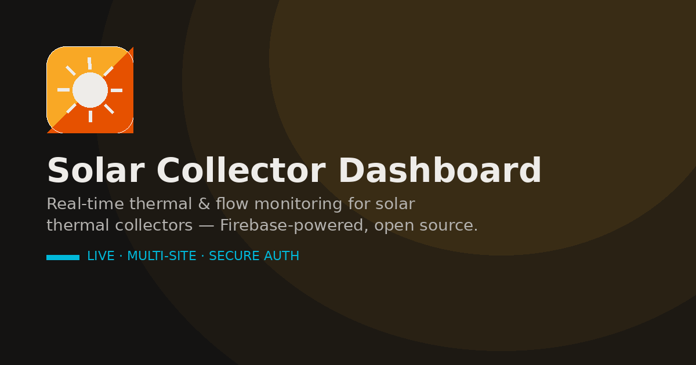

<div align="center">
  

  <h1>☀ SuryaDash Telemetry Dashboard</h1>

  <p>
    <strong>Enterprise-grade real-time monitoring and control system for solar thermal collectors.</strong>
  </p>

  <p>
    <a href="#features">Features</a> •
    <a href="#architecture">Architecture</a> •
    <a href="#getting-started">Getting Started</a> •
    <a href="#deployment">Deployment</a> •
    <a href="#hardware-integration">Hardware</a>
  </p>

  <p>
    
    
    
    
    
    
  </p>
</div>

---

## 📖 Overview

The **SuryaDash Telemetry Dashboard** is a highly responsive, multi-tenant web application designed to monitor, analyze, and control solar thermal collector rigs in real-time. 

Built with performance and dependency-free vanilla JavaScript, it connects directly to a **Firebase Realtime Database** to process live telemetry data from distributed ESP32 microcontrollers. It features advanced thermal calculations, configurable alert thresholds, multi-site management, and a robust fallback Demo Mode for evaluation.

---

## ✨ Enterprise Features

### 📊 Real-Time Telemetry & Monitoring
* **Multi-Sensor Tracking:** Monitors 4 temperature nodes (Storage, Inlet, Absorber, Outlet) and 2 flow meters.
* **Live Calculations:** Dynamically computes Thermal Power ($Q = \dot{m} \cdot c_p \cdot \Delta T$), Collector Efficiency ($\eta$), flow balance, and real-time pipe heat loss.
* **Offline Resilience:** PWA-enabled with a built-in Service Worker. Includes **Stale Data Detection** to gracefully flag disconnected edge devices.

### 🔔 Intelligent Alarming & Diagnostics
* **Predictive Warnings:** Detects stagnation, freeze risks, dry-run conditions, and flow imbalances.
* **Health Scoring:** Aggregates a composite system-health score based on sensor stability.
* **Rich Notifications:** In-browser toasts, sounds, and persistent alarm history logs.

### 🎮 Remote Command & Control
* **Actuator Control:** Toggle pumps, solenoid valves, and relays directly from the web interface.
* **Differential Control:** Advisory logic engine calculates optimal pump state based on $\Delta T$.

### 🔐 Security & Multi-Tenancy
* **Multi-Site Architecture:** Role-based access control (RBAC) via Firebase Auth. Manage multiple physical sites under a single account.
* **Rule-Based Validation:** Strict Firebase Security Rules (`database.rules.json`) enforce payload shapes and value ranges at the database level.

---

## 🏗️ High-Level Architecture

```mermaid
graph TD
    subgraph "Edge / Hardware (Field)"
        ESP32[ESP32 Controller]
        SENSORS[Temp & Flow Sensors]
        RELAYS[Pumps & Actuators]
        SENSORS -->|I2C / OneWire| ESP32
        ESP32 -->|GPIO| RELAYS
    end

    subgraph "Cloud Backend (Firebase)"
        RTDB[(Realtime Database)]
        AUTH[Firebase Authentication]
        HOST[Firebase Hosting]
    end

    subgraph "Client App (Browser)"
        UI[PWA Dashboard]
        LOGIC[Thermal Calculations & Alarms]
    end

    ESP32 -->|Push Telemetry (Wi-Fi)| RTDB
    RTDB -->|Sync States| ESP32
    
    UI <-->|REST API (Auth Token)| RTDB
    UI <-->|Login / RBAC| AUTH
    HOST -->|Serve Static Assets| UI
```

### Design Philosophy
1. **Serverless Orchestration:** The browser and the edge device never communicate directly. Firebase RTDB acts as the secure, low-latency intermediary.
2. **Zero-Build Frontend:** No Webpack, no React. Pure vanilla JavaScript ensuring near-instant load times and zero dependency vulnerabilities.
3. **Data Isolation:** Every site's data is partitioned in the database, protected by explicit read/write rules.

---

## 🚀 Getting Started (Local Demo)

You can run the dashboard locally in **Demo Mode** without any hardware or Firebase configuration.

```bash
# 1. Clone or extract the repository
cd solar-v7

# 2. Serve the directory locally (required for PWA features)
python3 -m http.server 8080

# 3. Open in your browser:
# http://localhost:8080 
# Click "Skip login — just show me the demo"
```

---

## ☁️ Connecting to Firebase (Production)

To connect real hardware and save user accounts, attach your own Firebase project:

1. **Create Project:** Go to the [Firebase Console](https://console.firebase.google.com/), create a project, and add a **Realtime Database**.
2. **Enable Auth:** Under Authentication > Sign-in method, enable **Email/Password**.
3. **Secure the DB:** Go to Realtime Database > Rules, and paste the contents of `firebase-config/database.rules.json`.
4. **Configure App:** Copy your **Web API Key** (Project settings > General). Open the local dashboard, click *Configure Firebase Web API Key*, and paste it.

---

## 🛠️ Hardware Integration

This system is designed to pair with an **ESP32**. 
* The firmware is located in `firmware/solar_esp32_firmware.ino`.
* Requires *OneWire*, *DallasTemperature*, and *ArduinoJson* libraries.
* See `firmware/README.md` for wiring diagrams and BOM.

> ⚠️ **Safety Warning:** Software is not a replacement for physical fail-safes. Always install mechanical pressure relief valves and thermal cut-outs on real solar heating rigs.

---

## 🧪 Testing & CI/CD

This project includes a comprehensive test suite covering static analysis, UI layout, and mock-database integration.

```bash
# Install testing dependencies
pip install playwright && playwright install chromium

# Run the full test suite
bash tests/run_all.sh
```
*Automated CI runs on every push via GitHub Actions.*

---

## 🌍 Deployment

You can deploy the static files to any host. We provide configuration for **Firebase Hosting** and **Vercel**.

1. Customize the white-label details:
   ```bash
   python3 deploy/configure.py --domain solar.yourdomain.com --company "Your Company" --email support@yourdomain.com --address "City, Country" --country "Country"
   ```
2. Deploy via Firebase CLI:
   ```bash
   npm install -g firebase-tools
   firebase login
   firebase deploy --only hosting
   ```

---

## 📄 License

This project is licensed under the **MIT License**. See the `LICENSE` file for details.
