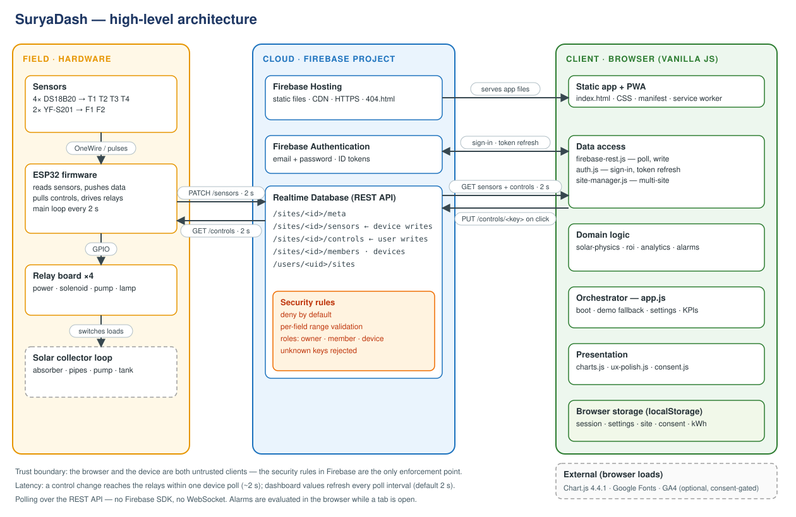
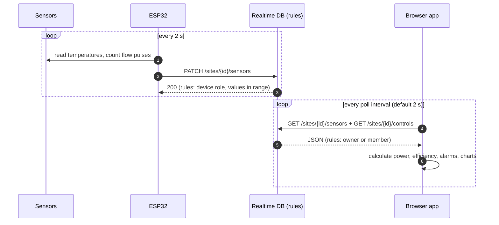
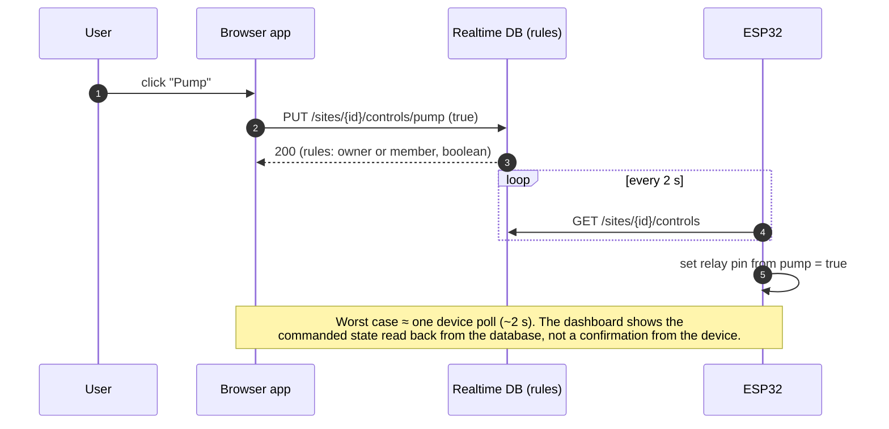
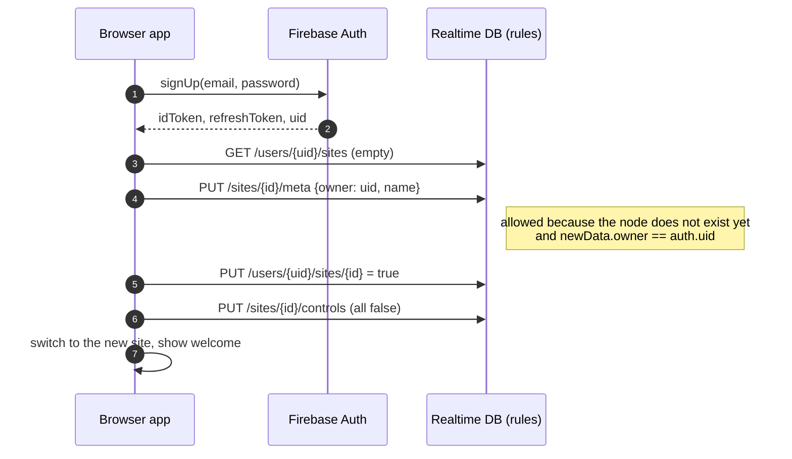
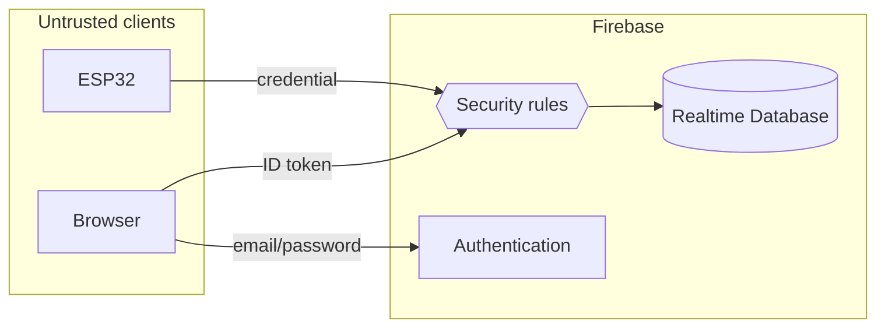

# Architecture

This document describes how the SuryaDash is put together: the components, how data
and commands move between them, where security is enforced, and how it behaves when something fails.
It describes the system **as built**; planned changes are listed in the README roadmap.

## 1. Design principles

| Principle | What it means here |
|---|---|
| **No build step** | Plain HTML, CSS and JavaScript modules loaded with `<script>` tags. Open the folder in a browser or any static host. |
| **No Firebase SDK** | The app talks to Firebase over its public **REST APIs** (`fetch`), keeping the bundle tiny and the data flow explicit. |
| **Rules are the security boundary** | The browser and the ESP32 are both treated as untrusted. Only the database rules decide who may read or write what. |
| **Degrade, don't crash** | Each module fails independently: no Chart.js → "Charts unavailable"; no Firebase → clearly labelled DEMO data. |
| **Honest status** | The header says LIVE only while real sensor data is arriving. Simulated data is always labelled DEMO. |

## 2. System context

| Actor | Role | Authenticated as |
|---|---|---|
| **Owner** | Creates sites, views data, toggles controls | Firebase Auth user (email/password) |
| **Member** | Views data, toggles controls on a shared site | Firebase Auth user listed in `/sites/<id>/members` |
| **Device (ESP32)** | Writes sensor readings, reads control states | Firebase credential listed in `/sites/<id>/devices` (see [firmware notes](../firmware/README.md)) |
| **Anonymous visitor** | Can load the static app only | none — every database path is denied |

## 3. Components

### 3.1 Field (hardware)

| Component | Responsibility |
|---|---|
| 4 × DS18B20 | Temperatures T1 storage, T2 inlet, T3 absorber, T4 outlet |
| 2 × YF-S201 | Pulse output → flow F1 inlet, F2 outlet (interrupt-counted) |
| ESP32 firmware | Every 2 s: read sensors → `PATCH …/sensors`; `GET …/controls` → drive relays. Reconnects Wi-Fi when lost |
| Relay board | Power supply, solenoid valve, pump, lamp |

### 3.2 Cloud (Firebase)

| Service | Responsibility |
|---|---|
| **Realtime Database** | Single source of truth for sensor values and control states, under `/sites/<id>/…` |
| **Security rules** | Deny by default; owner / member / device roles; numeric range validation; unknown keys rejected |
| **Authentication** | Email/password accounts; short-lived ID tokens (refreshed by the app) |
| **Hosting** | Serves the static files over HTTPS/CDN; serves `404.html` for unknown paths |

### 3.3 Client (browser)

Each file under `assets/js/` exposes one global object. They depend downward only through those globals.

| Layer | Module(s) | Responsibility |
|---|---|---|
| Orchestration | `app.js` | Auth gate, boot sequence, settings, thermal/health/KPI calculation, demo fallback, UI wiring |
| Data access | `firebase-rest.js` (`FB`) | Poll `/sensors` + `/controls`, write control values, track latency and failures |
| | `auth.js` (`AUTH`) | Sign in / up / out, token refresh one minute before expiry, session restore |
| | `site-manager.js` (`SITES`) | List, create and switch sites; path helpers |
| Domain logic | `solar-physics.js` (`SOLAR`) | Sun position, irradiance, sunrise/sunset (pure maths) |
| | `roi.js` (`ROI`) | Savings, differential-controller recommendation, pump uptime, 7-day history |
| | `analytics.js` (`ANALYTICS`) | Session statistics, analytics charts, printable report |
| | `alarms.js` (`ALARMS`) | Rule evaluation, sound, notifications, history |
| Presentation | `charts.js` (`CHARTS`), `ux-polish.js` (`UX`), `consent.js` (`CONSENT`), `tracking.js` (`TRACKING`) | Live charts, loading/validation states, storage notice, consent-gated analytics |
| PWA | `manifest.json`, `sw.js` | Installable shell; app files network-first, CDN assets cache-first; Firebase/Auth/Analytics never intercepted |

## 4. Key flows

### 4.1 Sensor data (device → dashboard)

### 4.2 Control command (dashboard → relay)

### 4.3 Sign-up and first site

If any of those writes is rejected, the app shows an error instead of continuing silently.

## 5. Security model

| Control | Where | Effect |
|---|---|---|
| Deny by default | `database.rules.json` root | Nothing is readable or writable unless a rule grants it |
| Per-site roles | rules under `/sites/$siteId` | owner · member · device, evaluated from `meta.owner`, `members`, `devices` |
| No whole-site read | rules | Members read only `/sensors` and `/controls`, never the `members`/`devices` lists |
| Range validation | rules | Temperatures −20…200 °C, flow 0…50 L/min, pressure 0…100 %; extra keys rejected |
| Public Web API key | client | An identifier, not a secret; the rules are what protect data |
| Consent-gated analytics | `consent.js` + `tracking.js` | GA4 loads only after "Accept", and only with a real measurement ID |

**Known weak points** (see roadmap): the firmware quick-start uses a legacy secret that bypasses rules;
the firmware does not verify TLS certificates; `firebase.json` sets no CSP/security headers; the CDN
scripts are not pinned with integrity hashes.

## 6. Client-side storage

| Key | Content |
|---|---|
| `solar-v6-session` | Auth session: ID token, refresh token, uid, email, expiry |
| `solar-v6-settings` | Thresholds, units, location, collector parameters, economics, theme, Firebase URL, Web API key |
| `solar-v6-active-site` | Last selected site ID |
| `solar-v7-consent` | `accepted` or `declined` |
| `solar-v5-daily` | Daily energy totals (last 30 days) for the 7-day chart |

The live data log (last 300 rows) is held in memory only and is lost on reload.

## 7. Failure behaviour

| Situation | What the user sees |
|---|---|
| Firebase unreachable | Badge `DISCONNECTED`; DEMO data after a short delay; polling continues at the normal interval and recovers by itself |
| Database reachable but empty | Badge `CONNECTED · NO DATA`; pill stays DEMO |
| Rules reject a request | Poll fails → `DISCONNECTED`; first-site creation failure shows an explicit error toast |
| ID token expiring | Refreshed automatically one minute before expiry; if Firebase rejects the refresh token the user is signed out |
| Chart.js blocked or offline | "Charts unavailable" panel; everything else keeps working |
| Browser offline | App shell served from the service-worker cache; data unavailable |
| **ESP32 stops sending** | **Not detected today** — the dashboard keeps showing the last values (see roadmap: stale-data detection) |
| **Browser tab closed** | **No alarms** — alarms are evaluated client-side only (see roadmap: server-side alerting) |

## 8. Extension points

| To add… | Touch… |
|---|---|
| A new sensor | firmware (push key) → rules (`sensors` validation) → `normalise()` and `applySnapshot()` in `app.js` → card in `index.html` |
| A new alarm | add a rule object in `alarms.js` (`buildRules`) and a threshold in Settings |
| A new control | rules (`controls` boolean) → `setupClicks()` mapping and card in `index.html` → firmware relay pin |
| A different backend | replace `firebase-rest.js` / `auth.js` / `site-manager.js`; the rest of the app reads plain objects via `FB.onData` |
